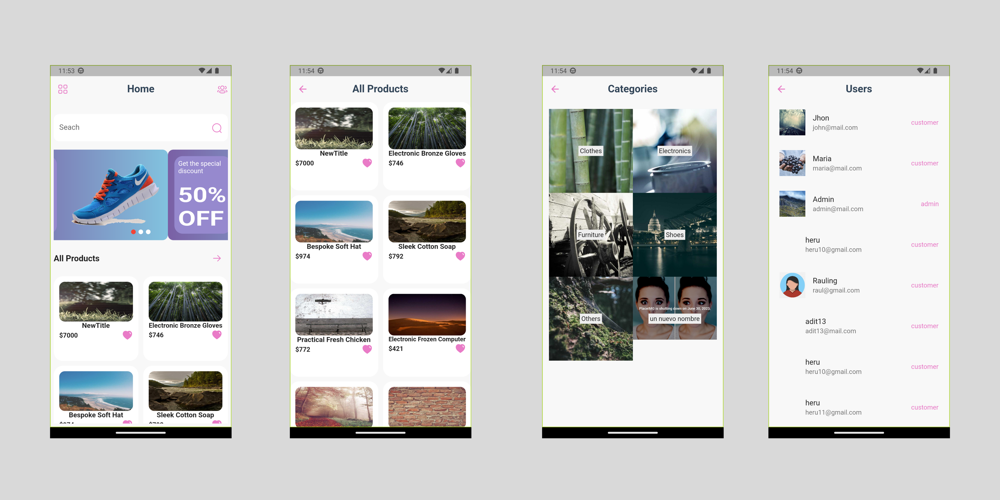

# Shop App

Shopping at home is better!


### Screens



### Features

- data from fake api
- url: https://fakeapi.platzi.com/

### Pakages

- cupertino_icons: ^1.0.2
- flutter_iconly: ^1.0.2
- card_swiper: ^2.0.4
- fancy_shimmer_image: ^2.0.2
- provider: ^6.0.5

### Author

[Phat Panhareach](https://github.com/Re4ch-Jay/)


### Usage

```bash
# Clone this repository
$ git clone https://github.com/Re4ch-Jay/Grocery-Shop.git

# Install dependencies
$ flutter packages get

# Run the app
$ flutter run
```